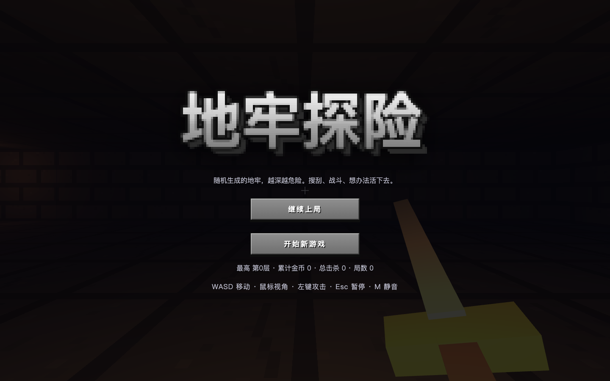

# Voxel Dungeon · 地牢探险

一款受方块世界视觉启发的第一人称 3D Roguelike 地牢游戏，使用 TypeScript 与 three.js 构建。所有纹理、关卡和音效均由代码生成，不依赖外部游戏素材。

随机地牢 · 实时战斗 · 搜刮成长 · 永久死亡



## 在线试玩

[打开 GitHub Pages 版本](https://majiayu000.github.io/voxel-dungeon/)

进入游戏后点击画面锁定鼠标。推荐使用桌面版 Chrome、Edge 或 Firefox。

## 游戏内容

- 程序化生成的多层地牢、房间和通道
- 第一人称移动、瞄准和投射物战斗
- 多种敌人、敌人 AI、寻路和头顶血条
- 暴击、击退、伤害飘字、震屏和命中停顿
- 战利品、经验、金币与楼层成长
- HUD、小地图、程序化火把、纹理和音效
- 单局续玩存档与跨局统计

## 操作

| 操作 | 按键 |
| --- | --- |
| 移动 | `W` `A` `S` `D` |
| 转向 | 鼠标或方向键 |
| 闪避（短暂无敌） | `Space` |
| 攻击 | 鼠标左键或 `F` |
| 暂停 | `Esc` |
| 暂停后继续 | 点击或 `Enter` |
| 静音 | `M` |

## 本地开发

需要 Node.js 20 或更新版本。

```bash
npm install
npm run dev
```

质量检查：

```bash
npm run typecheck
npm test
npm run build
```

## 项目结构

- `src/dungeon/`、`src/combat/`：与渲染解耦的纯逻辑模块及单元测试
- `src/engine/`、`src/render/`：three.js 引擎、场景与视觉效果
- `src/entities/`、`src/ai/`：玩家、敌人、投射物、掉落物与 AI
- `src/game/`：游戏组合根、世界状态和主循环
- `src/ui/`、`src/meta/`、`src/audio/`：界面、存档和程序化音效

## 技术栈

- TypeScript
- three.js
- Vite
- Vitest

## 许可证

[MIT](LICENSE)
